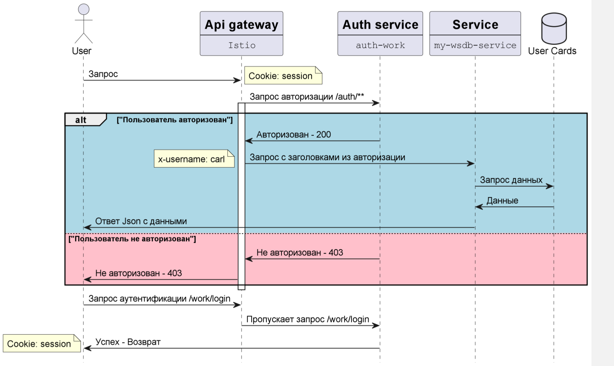
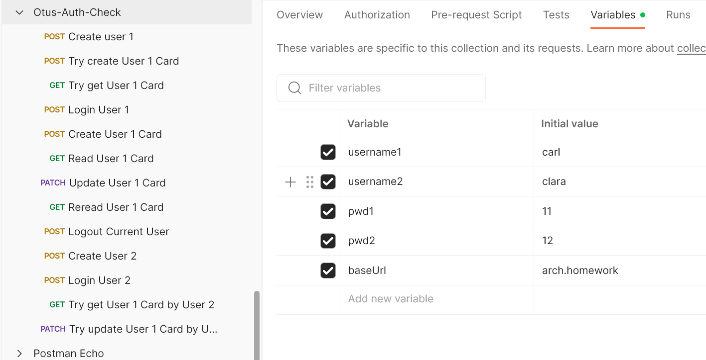

# Otus 06
Backend for frontends. Apigateway
# Результат выполнения задания
Студент: Дмитриев С.А. Группа OTUS MicroserviceArchitecture-2023-04

## Описание
В качестве Apigateway использован Istio.
Данные об аутентификации храню в памяти в сервисе аутентификации.
Карточки клиентов в проиложении из ДЗ 3. Приложение пришлось доработать, чтобы оно работало не по Id, а по username клиента. Поэтому карточка клиента создается отдельно от регистрации. 
Схема работы системы в изображении AuthorizationSchema.png

1. Istio маршрутизирует запросы на auth-service и my-wsdb-service. Эндпоинты auth-service /work/login и /work/logout исключены из проверки авторизации.
2. При поступлении запроса на my-wsdb-service, Istio обращается с кукой в auth-service /auth/ и если сессия в куке хорошая, то возвращает заголовок x-username со значением username из сессии.
3. Если куки нет или сессии нет, то Istio вернёт клиенту 401 ошибку.
4. Дальше sidecar istio-proxy на основании запрошенного пути и значение заголовка x-username примет решение о предоставлении данных клиенту. Сейчас условие, что путь должен содержать x-username.
5. Иначе Istio вернёт 403 ошибку.

## Процесс выполнения:
1. Установил Istio в неймспейс istio-system.
Установить оператор, разворачивающий Istio:
```shell
istioctl operator init --watchedNamespaces istio-system --operatorNamespace istio-operator
```
Развернуть Istio c помощью оператора:
```shell
kubectl apply -f istio-config/istio.yaml
```
Проверить состояние Istio:
```shell
kubectl get all -n istio-system -l istio.io/rev=default
```
Настроить Gateway:
```shell
kubectl apply -f istio-config/routes.yaml
```
2. Создал неймспейс zipper
```shell
kubectl apply -f ns-zipper/01_namespace_zipper.yaml
```
2. Установил PostgreSql в неймспейс zipper
```shell
helm install postgresql-test oci://registry-1.docker.io/bitnamicharts/postgresql --set auth.database=mydb,auth.postgresPassword=secretpassword -n zipper
```
3. Написал свой сервис авторизации и аутентификации на Java (auth-work)
4. Уcтановил auth-work в неймспейс granite (Создается неймспейс, деполоймент и сервис-нодепорт)
```shell
kubectl apply -f app-deploy/.
```
5. Установил приложение БД my-wsdb-service с помощью Helm в неймспейс zipper.
```shell
helm install wsdb-local myapp/. -n zipper
```
6. Сделал настройки Istio для аутентификации и авторизации.
```shell
kubectl apply -f istio-config/auth.yaml
```
```shell
kubectl apply -f istio-config/wsdb-auth.yaml
```
7. Сделал коллекцию postman для проверки предложенного сценария (Otus-Auth-Check.json) При повторном запуске сценария будет ошибка при создании карточки клиента 1, потому что карточка в БД уже будет.
```shell
newman run Otus-Auth-Check.json --verbose
```


Всё.
